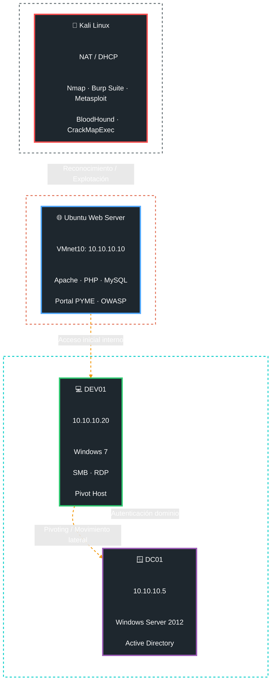

# TFM-Ciber-CEU-Jose-Torre


## Índice

- [Introducción](#introducción)
- [Objetivos específicos](#objetivos-específicos)
- [Metodología](#metodología)
- [OWASP Top 10 2025](#owasp-top-10-2025)
- [Arquitectura del laboratorio](#arquitectura-del-laboratorio)
- [Diseño del portal vulnerable](#-portal-pyme-vulnerable--enfoque-y-diseño)
- [Despliegue e instalación del laboratorio](#despliegue-e-instalación-del-laboratorio)
- [Credenciales de acceso](#credenciales-de-acceso-opcional)
- [Puesta en marcha](#puesta-en-marcha)
- [Fases de desarrollo del laboratorio](#fases-de-desarrollo-del-laboratorio)
- [Justificación global del orden de las fases](#justificación-global-del-orden-de-las-fases)
- [Resultados esperados](#resultados-esperados-medibles)

> [!WARNING]  
> Tanto la estructura como el diseño del laboratorio pueden sufrir cambios a medida que se desarrolla el proyecto.

---

## Introducción

**📌 Título**: Laboratorio Red Team con escenarios de ataque reproducibles

**📖 Descripción**: Diseño de un laboratorio completo de Red Team que se puede desplegar fácilmente desde cero. Incluye varios escenarios de ataque guiados, documentados y repetibles para practicar técnicas reales de Red Team.

Para representar de forma realista el entorno tecnológico de una PYME o startup, este laboratorio se centrará en una aplicación web expuesta a vulnerabilidades frecuentes en entornos de desarrollo rápido y recursos limitados. En este tipo de organizaciones es habitual encontrar fallos derivados de configuraciones inseguras, controles de acceso deficientes, autenticación débil, dependencia de componentes de terceros y errores en el manejo de datos o excepciones.

Por ello, el laboratorio tomará como referencia el OWASP Top 10 2025, seleccionando las categorías más representativas para simular un escenario cercano a la realidad y estudiar tanto su explotación como sus posibles mitigaciones.

## Objetivos específicos

- 🧱 Diseñar una arquitectura de laboratorio aislada y segura.
- 💻 Implementar una máquina vulnerable basada en un entorno web tipo PYME.
- ⚠️ Integrar vulnerabilidades representativas del OWASP Top 10.
- 📚 Definir y documentar escenarios de ataque reproducibles.
- 🧪 Ejecutar pruebas de explotación manual siguiendo metodologías de pentesting.
- 📝 Generar una guía técnica detallada de los ataques realizados.

## Metodología

El trabajo seguirá un enfoque experimental, basado en el diseño, implementación y validación de un laboratorio práctico.

Las fases serán:

1. **🏗️ Diseño del entorno**: Definición de la arquitectura de red, sistemas y servicios vulnerables.
2. **⚙️ Implementación del laboratorio**: Despliegue de máquinas virtuales y configuración de servicios.
3. **🧨 Introducción de vulnerabilidades**: Configuración de fallos de seguridad basados en OWASP Top 10.
4. **🎯 Ejecución de ataques**: Aplicación de técnicas de reconocimiento, explotación y post-explotación.
5. **📊 Documentación y validación**: Registro de resultados y elaboración de guías reproducibles.

## OWASP Top 10 2025

[**🚨 OWASP Top 10 2025: riesgos más críticos**](https://owasp.org/Top10/2025/0x00_2025-Introduction/)

| # | Vulnerabilidad | Descripción breve PYME | Ejemplo realista |
| --- | --- | --- | --- |
| A01 | 🔓 Broken Access Control | Acceso no autorizado | Admin ve clientes de otros, bypass de ID de usuario |
| A02 | ⚙️ Security Misconfiguration | Configuración insegura | PHP error reporting activado, headers ausentes, `.git` expuesto |
| A03 | 📦 Software Supply Chain Failures | Fallos en la cadena de suministro | Dependencias sin actualizar, vulnerabilidades en npm o composer |
| A04 | 🔐 Cryptographic Failures | Cifrado débil | Contraseñas MD5, cookies sin `Secure` |
| A05 | 💉 Injection | SQLi, XSS, command injection | Formulario de login sin consultas preparadas |
| A06 | 🧠 Insecure Design | Diseño sin threat modeling | Reset de contraseña sin rate limit, flujo de autenticación débil |
| A07 | 🔑 Authentication Failures | Fallos de autenticación | Sesiones eternas, reutilización de contraseñas |
| A08 | 📉 Software/Data Integrity Failures | Integridad rota | Deserialización insegura, actualizaciones sin verificación |
| A09 | 📜 Security Logging Failures | Sin logs ni alertas | No registra intentos de login fallidos ni eventos sospechosos |
| A10 | 💥 Mishandling Exceptional Conditions | Errores que revelan información | Stack traces completos en el frontend |

## 🏢 Escenario corporativo avanzado

El laboratorio se plantea como una infraestructura segmentada orientada a reproducir un entorno empresarial realista. Para ello, se simula la arquitectura típica de una PYME, diferenciando entre los servicios expuestos inicialmente y una red interna corporativa donde se ubican sistemas adicionales, recursos compartidos y un entorno Windows basado en Active Directory.

La infraestructura incluye:

- 🌐 Servidor web vulnerable expuesto en DMZ.
- 🪟 Infraestructura Windows y Active Directory.
- 🔐 Segmentación de red y acceso restringido.
- 🔄 Pivoting y movimiento lateral.
- 📂 Recursos compartidos y credenciales internas.
- 🧠 Simulación de errores de configuración reales.

El objetivo es permitir ataques encadenados que reproduzcan el ciclo completo de una intrusión realista.
## Arquitectura del laboratorio

El laboratorio se ha diseñado con una arquitectura segmentada y progresiva, orientada a reproducir un entorno corporativo realista en el que puedan desarrollarse distintas fases de un ejercicio Red Team. La infraestructura funciona sobre una red virtual de tipo NAT, siguiendo un enfoque similar al utilizado en laboratorios de máquinas vulnerables como VulnHub, donde la máquina atacante y el servidor web vulnerable comparten una red virtual controlada y pueden comunicarse entre sí sin necesidad de exponer directamente los servicios a la red física externa.

La arquitectura del laboratorio se estructura en varios segmentos diferenciados, combinando una máquina atacante (que puede ser propia del usuario), un servidor vulnerable expuesto y una red interna corporativa. Esta organización permite representar un escenario realista en el que el atacante obtiene primero acceso a un sistema vulnerable y, posteriormente, utiliza ese punto de entrada para enumerar servicios internos, realizar pivoting y avanzar hacia un entorno Windows basado en Active Directory.

La primera zona de la infraestructura corresponde a la red donde se encuentra desplegado el servidor Ubuntu Server vulnerable. Esta máquina aloja el portal web corporativo desarrollado para el proyecto, junto con distintas vulnerabilidades basadas en el OWASP Top 10. Además de representar el punto de acceso inicial al entorno, este servidor puede actuar posteriormente como sistema pivote hacia redes internas.

La segunda zona corresponde a la red interna corporativa, separada lógicamente del segmento inicial. En ella se integran distintos sistemas internos, incluyendo un controlador de dominio Windows Server con Active Directory y estaciones de trabajo Windows. Esta segmentación permite reproducir técnicas reales de movimiento lateral, enumeración interna, robo de credenciales y escalada de privilegios en entornos corporativos.

La infraestructura se organiza principalmente en dos segmentos:

- Red NAT inicial → comunicación entre Kali Linux y la máquina vulnerable.
- Red interna corporativa → segmento interno donde se ubican Active Directory, estaciones Windows y servicios auxiliares.

La arquitectura ha sido diseñada siguiendo una filosofía modular y escalable, permitiendo incorporar progresivamente nuevos escenarios ofensivos, servicios vulnerables y mecanismos de defensa sin modificar la estructura principal del laboratorio. Esto permite que el entorno evolucione desde un laboratorio web básico hasta una infraestructura completa orientada a simulaciones Red Team realistas.



### Web server: Ubuntu Server 22.04

El servidor web funcionará como servidor web
- 🌐 Apache 2.4.52.
- 🐘 PHP 8.1 con `display_errors=On`.
- 🗄️ MySQL 8.0.
- 🎯 DVWA + 5 vulnerabilidades custom OWASP.
- 📦 Dependencias npm/pip vulnerables.

**⚠️ Nota**: Para facilitar el desarrollo de este laboratorio, también se instaló un entorno gráfico `xfce4`.


## 🪟 Infraestructura Active Directory

El laboratorio incorpora una infraestructura Active Directory básica para simular un entorno corporativo Windows realista.

### Componentes desplegados

- 🖥️ Controlador de dominio Windows Server.
- 👤 Usuarios corporativos simulados.
- 🏢 Dominio interno.
- 📂 Recursos SMB compartidos.
- 🔑 Políticas de autenticación débiles.
- 📡 Servicios WinRM, SMB y RDP.

### Objetivos de seguridad

La integración de Active Directory permite practicar técnicas habituales de post-explotación y Red Team:

- Enumeración de dominio.
- Password spraying.
- Kerberoasting.
- Enumeración SMB.
- Captura de credenciales.
- Movimiento lateral.
- Escalada de privilegios.
- Persistencia.

### Escenarios reproducidos

El laboratorio recrea configuraciones inseguras frecuentes en entornos corporativos:

- Contraseñas débiles.
- Shares accesibles.
- Usuarios reutilizados.
- Servicios mal configurados.
- Privilegios excesivos.


---


### Configuración de las máquinas virtuales


#### 🧱 Web server (Ubuntu server 22.04)

> 📛 Nombre: maquina-victima-ubuntu-server-TFM 
> 💿 ISO: ubuntu-22.04.4-live-server-amd64.iso  
> ⚙️ CPU: 2 cores  
> 🧠 RAM: 3GB  
> 💾 Disco: 40GB thin  
> 🌐 Red NAT: VMnet8 / DHCP 
> 🌐 Red interna: VMnet10 (10.10.10.10/24)

**Post-instalación Ubuntu (en VM):**

``` 
# IP fija
sudo nano /etc/netplan/01-netcfg.yaml
```

``` 
network:
  version: 2

  ethernets:

    ens33:
      dhcp4: true

    ens37:
      dhcp4: no
      addresses:
        - 10.10.10.10/24
```

``` 
sudo netplan apply
```


#### 🐉 VM Atacante (Kali Linux)

En el caso de contar con ninguna máquina que actúe como atacante, se recomienda instalar Kali con la siguiente configuración:

> 📛 Nombre: maquina-atacante-kali-TFM  
> 💿 ISO: kali-linux-2026.1-installer-amd64.iso  
> ⚙️ CPU: 4 cores  
> 🧠 RAM: 3GB  
> 💾 Disco: 80GB thin  
> 🌐 Red NAT: VMnet8 / DHCP

``` 
# Configuración NAT por DHCP
sudo nano /etc/network/interfaces  
```

```
auto lo
iface lo inet loopback

# NAT (Internet)
auto eth0
iface eth0 inet dhcp
```

> [!NOTE]
> En la pagina oficial kali tambien se pueden descargar maquinas virtuales ya construidas, tanto para VMware como para Virtualbox, entre otros

#### 🪟 DC01 (Windows Server 2012 - Active Directory)

> 📛 Nombre: DC01  
> 💿 ISO: Windows Server 2012  
> ⚙️ CPU: 2 cores  
> 🧠 RAM: 4GB  
> 💾 Disco: 60GB thin  
> 🌐 Red interna: 10.10.10.5/24  
> 🏢 Rol: Controlador de dominio  

La máquina `DC01` actúa como controlador de dominio principal del entorno corporativo simulado. Sobre ella se despliega Active Directory y los servicios básicos necesarios para representar una infraestructura Windows empresarial vulnerable.

### Configuración mínima recomendada

| Parámetro | Valor |
|---|---|
| Hostname | `DC01` |
| Dominio | `corp.local` |
| Dirección IP | `10.10.10.5` |
| Máscara | `255.255.255.0` |
| Gateway | `10.10.10.10` |
| DNS | `127.0.0.1` |

### Servicios instalados

- Active Directory Domain Services (AD DS)
- DNS
- SMB
- WinRM
- Comparticiones de red
- Usuarios y grupos corporativos

### Configuración utilizada en el laboratorio

- Dominio: `corp.local`


#### 💻 DEV01 (Windows 7 - Estación corporativa)

> 📛 Nombre: DEV01  
> 💿 ISO: Windows 7 Professional  
> ⚙️ CPU: 2 cores  
> 🧠 RAM: 3GB  
> 💾 Disco: 40GB thin  
> 🌐 Red interna: 10.10.10.20/24  
> 🧩 Rol: Estación de trabajo corporativa  

La máquina `DEV01` representa un equipo de usuario dentro de la red corporativa. Su objetivo es simular una estación de trabajo vulnerable accesible únicamente desde la red interna.

### Configuración mínima recomendada

| Parámetro | Valor |
|---|---|
| Hostname | `DEV01` |
| Dominio | `corp.local` |
| Dirección IP | `10.10.10.20` |
| Máscara | `255.255.255.0` |
| Gateway | `10.10.10.5` |
| DNS | `10.10.10.5` |

### Configuración utilizada en el laboratorio

- Equipo unido al dominio `corp.local`.
- Usuario corporativo estándar

---

## Despliegue e instalación del laboratorio

El laboratorio puede ponerse en marcha de dos formas:

- Importando las máquinas virtuales preconfiguradas.
- Realizando una instalación manual desde cero.

### 🌍 Configuración de red

El laboratorio utiliza dos redes virtuales diferenciadas en VMware:

- **VMnet8 (NAT)**: red utilizada para proporcionar conectividad hacia el exterior cuando sea necesario.
- **VMnet10 (red interna del laboratorio)**: red privada utilizada para interconectar las máquinas del escenario corporativo.

La red principal del laboratorio es `VMnet10`, configurada como una red virtual interna con la subred `10.10.10.0/24`. En esta red se ubican las máquinas internas del entorno, como `DC01`, `DEV01` y la interfaz interna de la máquina Ubuntu vulnerable.

Para configurar esta red:

1. Abrir **VMware → Edit → Virtual Network Editor**.
2. Crear o seleccionar la red **VMnet10**.
3. Configurar la subred como `10.10.10.0/24`.
4. Desactivar el servicio DHCP para utilizar direcciones IP estáticas.
5. Asignar a las máquinas del laboratorio el adaptador **Custom: VMnet10**.
6. Mantener `VMnet8` como red NAT para aquellas máquinas que necesiten acceso a Internet.

Esta configuración permite separar la conectividad externa de la red interna del laboratorio y facilita la simulación de pivoting, enumeración interna y movimiento lateral.


### Opción 1. Importación de máquinas virtuales

#### 1. Descarga e importación

1. Descargar los archivos comprimidos (`.zip`) de las máquinas virtuales. 

- [MEGA](https://mega.nz/folder/uuoWnTCa#gCMeFu6JBzY6sQEWtxb_SQ)
- [OneDrive](https://outlook.cloud.microsoft/host/377c982d-9686-450e-9a7c-22aeaf1bc162/7211f19f-262a-42eb-a02e-289956491741)

Esto nos descargará tres máquinas virtuales:
- Máquina atacante (kali)
- Máquina victima servidor web (Ubuntu server)

2. Descomprimir el contenido.
3. Importar cada máquina en VMware:
   - **Archivo → Importar**
   - Seleccionar el fichero `.ovf`

#### 2. Verificación

Si la conectividad es correcta, acceder al portal web desde el navegador de Kali:

```
http://<IP_NAT_WEB_SERVER>:8080/portal_pyme
```


### Opción 2. Instalación manual

En caso de no utilizar las máquinas virtuales preconfiguradas, el laboratorio puede desplegarse manualmente.

#### 🧱 1. Instalación en el servidor web 
Una vez creada la máquina Ubuntu Server 22.04.4 y configurada su IP, ejecutar:

En el **servidor web** (Ubuntu server) se instala todo el laboratorio usando Docker mediante el script del repositorio.

##### Paso 1: Clonar el repositorio TFM

1. Abre un terminal en el servidor web.
2. Asegúrate de tener `git` instalado:

   ```bash
   sudo apt update
   sudo apt install -y git
   ```

3. Clona el repositorio TFM:

   ```bash
   git clone https://github.com/AmasterJT/TFM-Ciber-CEU-Jose-Torre.git
   cd TFM-Ciber-CEU-Jose-Torre
   ```

##### Paso 2: Ejecutar el script de despliegue

1. Asegúrate de que el script `scripts/setup_tfm_lab.sh` está en el repositorio.
2. Dale permisos de ejecución:

   ```bash
   chmod +x scripts/setup_tfm_lab.sh
   ```

3. Ejecuta el script con permisos de superusuario:

   ```bash
   sudo ./scripts/setup_tfm_lab.sh
   ```

El script realizará automáticamente:

- Instalación de Docker y Docker Compose Plugin.
- Copia del laboratorio a `/opt/tfm-lab`.
- Creación de usuarios (`dev`, `victima`) y grupo `developers`.
- Configuración de permisos, credenciales expuestas en `shared/dev_credentials.txt`.
- Configuración de SSH con autenticación por contraseña.
- Configuración de `sudo` para PATH hijacking.
- Levantado del portal vulnerable en Docker (puerto 8080).

Al finalizar, el script mostrará un resumen con:

- IP del servidor web.
- URL para acceder al portal web: `http://<IP_NAT_WEB_SERVER>:8080/portal_pyme`.
- Usuario y contraseña de `dev`.
- Ruta del script vulnerable para escalada de privilegios: `/opt/scripts/backup.sh`.

#### 🐉 2. Configuración de la máquina atacante

En la máquina Kali Linux no es necesario instalar software adicional para el despliegue del laboratorio. Únicamente debe configurarse el adaptador de red para la red NAT.

## 🔐 Credenciales de acceso opcional

Para mantener la misma configuración que las máquinas descargadas, deben configurarse las siguientes credenciales:

| Sistema | Usuario | Contraseña |
| --- | --- | --- |
| Ubuntu (víctima) | victima | victima123 |
| Kali Linux | kali | kali |

## Puesta en marcha

Una vez completados los pasos anteriores, el laboratorio quedará operativo y listo para comenzar las pruebas de seguridad desde la máquina atacante.

## 🏢 Portal PYME Vulnerable – Enfoque y Diseño
### 📌 Descripción general

Este proyecto consiste en el desarrollo de un portal web corporativo simulado orientado a representar el entorno tecnológico típico de una pequeña o mediana empresa (PYME).

El objetivo principal es construir una máquina vulnerable realista que permita practicar técnicas de pentesting y Red Team, siguiendo una estructura similar a plataformas como Hack The Box o TryHackMe.

El portal incluye funcionalidades habituales en entornos empresariales, como gestión de empleados, clientes y tickets de soporte, integrando vulnerabilidades de forma intencionada para su explotación controlada.

> [!NOTE]
> Para más información leer el fichero `creacion-portal-pyme.md` 


## 🧠 Fases de desarrollo del laboratorio

### Fase 1 – Vulnerabilidades críticas iniciales

🔎 *(A01, A02, A05: control de acceso, configuración insegura e inyección)*

#### Contenido de la fase

En esta primera fase se implementan vulnerabilidades relacionadas con:

- 🔓 Fallos en el control de acceso.
- ⚙️ Configuraciones inseguras de los sistemas.
- 💉 Vulnerabilidades de inyección, como SQL Injection o command injection.

Estas vulnerabilidades han sido seleccionadas como punto de partida debido a su alta prevalencia en entornos reales y su impacto crítico en la seguridad de los sistemas. Además, constituyen uno de los vectores de ataque más comunes utilizados por actores maliciosos para obtener acceso inicial a un sistema.

Desde el punto de vista metodológico, esta fase representa la etapa de acceso inicial dentro de un proceso de pentesting o ataque real.

#### Objetivos técnicos

- 🚪 Obtener acceso inicial al sistema objetivo.
- 🔍 Realizar tareas básicas de enumeración.
- ⚠️ Comprometer parcialmente el sistema.

### Fase 2 – Fallos de autenticación y criptografía

🔎 *(A04, A07: fallos criptográficos y de autenticación)*

#### Contenido de la fase

En esta fase se abordan vulnerabilidades relacionadas con:

- 🔑 Uso de contraseñas débiles o mal gestionadas.
- 🧩 Implementación insegura de mecanismos de autenticación.
- 🔐 Deficiencias en el uso de técnicas criptográficas.

El desarrollo de esta fase se apoya en los resultados obtenidos en la fase anterior, dado que es necesario disponer de un acceso inicial para poder explotar este tipo de vulnerabilidades en profundidad.

Estas debilidades permiten ampliar el alcance del ataque, facilitando la escalada de privilegios, el mantenimiento del acceso al sistema y el compromiso de cuentas adicionales.

Desde una perspectiva metodológica, esta fase se corresponde con la etapa de post-explotación temprana, centrada en la consolidación del acceso y la elevación de privilegios.

#### Objetivos técnicos

- ⬆️ Escalar privilegios dentro del sistema.
- 🔁 Mantener acceso persistente.
- 👤 Comprometer cuentas de usuario.

---

## 🔀 Pivoting y movimiento lateral

Uno de los objetivos principales del laboratorio es reproducir escenarios de intrusión multi-etapa similares a los utilizados en ejercicios Red Team reales.

Tras comprometer el servidor web inicial, el atacante deberá utilizar técnicas de pivoting para acceder a redes internas no accesibles directamente.

### Técnicas implementadas

- SOCKS Proxy.
- SSH Tunneling.
- Port Forwarding.
- Reverse Tunneling.
- Pivoting mediante el servidor web comprometido y acceso posterior a DEV01.
- Enumeración de redes internas.

### Herramientas utilizadas

- Chisel
- Ligolo-ng
- Proxychains
- SSH
- Metasploit

## ⛓️ Cadena completa de ataque

El laboratorio está diseñado para permitir una progresión ofensiva completa basada en metodologías reales de Red Team.

### Flujo general de ataque

```text
Reconocimiento externo
        ↓
Enumeración web
        ↓
Explotación OWASP
        ↓
Obtención de reverse shell
        ↓
Escalada de privilegios Linux
        ↓
Pivoting hacia red interna
        ↓
Enumeración Active Directory
        ↓
Compromiso de credenciales
        ↓
Movimiento lateral
        ↓
Compromiso del dominio
```


---

## 🎯 Mapeo MITRE ATT&CK

Las técnicas implementadas en el laboratorio están alineadas con el framework MITRE ATT&CK.

| Técnica | ID MITRE |
|---|---|
| Exploit Public-Facing Application | T1190 |
| Command and Scripting Interpreter | T1059 |
| Exploitation for Privilege Escalation | T1068 |
| Credential Dumping | T1003 |
| Lateral Tool Transfer | T1570 |
| Proxy / Pivoting | T1090 |
| Remote Services | T1021 |
| Kerberoasting | T1558.003 |
| SMB/Windows Admin Shares | T1021.002 |

Este mapeo permite relacionar el laboratorio con tácticas y técnicas utilizadas en ataques reales.

## Justificación global del orden de las fases

La secuencia de fases definida en este trabajo responde a una progresión lógica basada en metodologías reales de ataque utilizadas en entornos de ciberseguridad ofensiva.

En primer lugar, se aborda la obtención de acceso inicial al sistema mediante la explotación de vulnerabilidades críticas. A continuación, se profundiza en la escalada de privilegios y la persistencia dentro del entorno comprometido. Finalmente, se analizan aspectos más avanzados relacionados con la evasión de controles de seguridad, la detección de incidentes y la madurez global del sistema.

Esta estructura es coherente con modelos ampliamente utilizados en el ámbito de la ciberseguridad, como la Cyber Kill Chain o el framework MITRE ATT&CK, en los que se distinguen fases como acceso inicial, escalada de privilegios y evasión de defensas.

## Resultados esperados

- Laboratorio funcional desplegable desde cero.
- Máquina vulnerable completamente documentada.
- Conjunto de al menos 8–10 vulnerabilidades explotables.
- Guía paso a paso de explotación de cada vulnerabilidad.
- Evidencias de ejecución: capturas, logs y comandos.
- Validación de reproducibilidad del entorno.