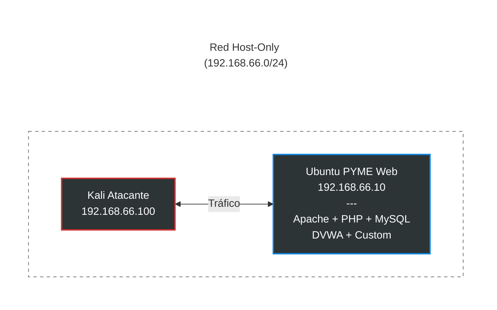

# TFM-Ciber-CEU-Jose-Torre


## Índice

- [Introducción](#introducción)
- [Objetivos específicos](#objetivos-específicos)
- [Metodología](#metodología)
- [OWASP Top 10 2025](#owasp-top-10-2025)
- [Arquitectura del laboratorio](#arquitectura-del-laboratorio)
- [Despliegue e instalación del laboratorio](#despliegue-e-instalación-del-laboratorio)
- [Credenciales de acceso](#credenciales-de-acceso-opcional)
- [Puesta en marcha](#puesta-en-marcha)
- [Fases de desarrollo del laboratorio](#fases-de-desarrollo-del-laboratorio)
- [Justificación global del orden de las fases](#justificación-global-del-orden-de-las-fases)
- [Resultados esperados](#resultados-esperados-medibles)

---

## Introducción

**📌 Título**: Laboratorio Red Team con escenarios de ataque reproducibles

**📖 Descripción**: Diseño de un laboratorio completo de Red Team que se puede desplegar fácilmente desde cero. Incluye varios escenarios de ataque guiados, documentados y repetibles para practicar técnicas reales de Red Team.

Para representar de forma realista el entorno tecnológico de una PYME o startup, este laboratorio se centrará en una aplicación web expuesta a vulnerabilidades frecuentes en entornos de desarrollo rápido y recursos limitados. En este tipo de organizaciones es habitual encontrar fallos derivados de configuraciones inseguras, controles de acceso deficientes, autenticación débil, dependencia de componentes de terceros y errores en el manejo de datos o excepciones.

Por ello, el laboratorio tomará como referencia el OWASP Top 10 2025, seleccionando las categorías más representativas para simular un escenario cercano a la realidad y estudiar tanto su explotación como sus posibles mitigaciones.

## Objetivos específicos

- 🧱 Diseñar una arquitectura de laboratorio aislada y segura mediante red host-only.
- 💻 Implementar una máquina vulnerable basada en un entorno web tipo PYME.
- ⚠️ Integrar vulnerabilidades representativas del OWASP Top 10.
- 📚 Definir y documentar escenarios de ataque reproducibles.
- 🧪 Ejecutar pruebas de explotación manual siguiendo metodologías de pentesting.
- 📝 Generar una guía técnica detallada de los ataques realizados.

## Metodología

El trabajo seguirá un enfoque experimental, basado en el diseño, implementación y validación de un laboratorio práctico.

Las fases serán:

1. **🏗️ Diseño del entorno**: Definición de la arquitectura de red, sistemas y servicios vulnerables.
2. **⚙️ Implementación del laboratorio**: Despliegue de máquinas virtuales y configuración de servicios.
3. **🧨 Introducción de vulnerabilidades**: Configuración de fallos de seguridad basados en OWASP Top 10.
4. **🎯 Ejecución de ataques**: Aplicación de técnicas de reconocimiento, explotación y post-explotación.
5. **📊 Documentación y validación**: Registro de resultados y elaboración de guías reproducibles.

## OWASP Top 10 2025

[**🚨 OWASP Top 10 2025: riesgos más críticos**](https://owasp.org/Top10/2025/0x00_2025-Introduction/)

| # | Vulnerabilidad | Descripción breve PYME | Ejemplo realista |
| --- | --- | --- | --- |
| A01 | 🔓 Broken Access Control | Acceso no autorizado | Admin ve clientes de otros, bypass de ID de usuario |
| A02 | ⚙️ Security Misconfiguration | Configuración insegura | PHP error reporting activado, headers ausentes, `.git` expuesto |
| A03 | 📦 Software Supply Chain Failures | Fallos en la cadena de suministro | Dependencias sin actualizar, vulnerabilidades en npm o composer |
| A04 | 🔐 Cryptographic Failures | Cifrado débil | Contraseñas MD5, cookies sin `Secure` |
| A05 | 💉 Injection | SQLi, XSS, command injection | Formulario de login sin consultas preparadas |
| A06 | 🧠 Insecure Design | Diseño sin threat modeling | Reset de contraseña sin rate limit, flujo de autenticación débil |
| A07 | 🔑 Authentication Failures | Fallos de autenticación | Sesiones eternas, reutilización de contraseñas |
| A08 | 📉 Software/Data Integrity Failures | Integridad rota | Deserialización insegura, actualizaciones sin verificación |
| A09 | 📜 Security Logging Failures | Sin logs ni alertas | No registra intentos de login fallidos ni eventos sospechosos |
| A10 | 💥 Mishandling Exceptional Conditions | Errores que revelan información | Stack traces completos en el frontend |

## Arquitectura del laboratorio

El laboratorio se ha diseñado con una arquitectura mínima pero realista, compuesta por dos máquinas virtuales conectadas a una red aislada de tipo host-only. Esta configuración permite reproducir un entorno controlado de pruebas sin exponer los sistemas a la red física del equipo anfitrión ni a Internet, salvo que se añada de forma intencionada un segundo adaptador para tareas de mantenimiento y actualización.

La primera máquina virtual actúa como máquina atacante y utiliza Kali Linux. Su función es representar el sistema desde el que se realizarán las pruebas de seguridad, el reconocimiento de servicios, la enumeración de vulnerabilidades y la explotación controlada de los fallos presentes en la máquina víctima.

La segunda máquina virtual corresponde a la máquina víctima, basada en Ubuntu Server, sobre la que se desplegará la aplicación web vulnerable y los servicios necesarios para simular el entorno de una PYME o startup.

Ambas máquinas se encuentran dentro de la subred `192.168.66.0/24`, con direcciones IP fijas para facilitar la documentación, la repetición de pruebas y la restauración del entorno mediante snapshots. En esta fase inicial, la arquitectura se mantiene deliberadamente sencilla para asegurar que el foco del trabajo esté en la construcción progresiva de vulnerabilidades web y en su análisis técnico.



### ¿Por qué usar una red Host-only?

- 🛡️ Evita que una máquina vulnerable quede expuesta a tu red real.
- 🎯 Permite crear una topología controlada y reproducible.
- 🔄 Facilita snapshots, resets y pruebas repetibles.
- 🔗 Permite que varias VMs se comuniquen entre sí sin riesgo externo.

### VM víctima: Ubuntu Server 22.04

La máquina víctima funcionará como servidor web con la siguiente configuración base:

- 🌐 Apache 2.4.52.
- 🐘 PHP 8.1 con `display_errors=On`.
- 🗄️ MySQL 8.0.
- 🎯 DVWA + 5 vulnerabilidades custom OWASP.
- 📦 Dependencias npm/pip vulnerables.

**⚠️ Nota**: Para facilitar el desarrollo de este laboratorio, también se instaló un entorno gráfico `xfce4`.


---


### Configuracion de las máquinas virtuales


#### 🧱 VM Víctima (Ubuntu server 22.04)

> 📛 Nombre: maquina-victima-ubuntu-server-TFM 
> 💿 ISO: ubuntu-22.04.4-live-server-amd64.iso  
> ⚙️ CPU: 2 cores  
> 🧠 RAM: 4GB  
> 💾 Disco: 40GB thin  
> 🌐 Red: VMnet10 (192.168.66.10)  

**Post-instalación Ubuntu (en VM):**

``` 
# IP fija
sudo nano /etc/netplan/01-netcfg.yaml
```

``` 
network:
  ethernets:
    ens33:
      dhcp4: no
      addresses: [192.168.66.10/24]
      gateway4: 192.168.66.1
      nameservers:
        addresses: [8.8.8.8]
  version: 2
```

``` 
sudo netplan apply
```

> [!INFO]  
> Si se desea disponer de acceso a Internet en la máquina víctima, se puede añadir un segundo adaptador de red (por ejemplo, NAT) y configurar `netplan` de la siguiente forma:

>```yaml
network:
  version: 2
  ethernets:
    ens33:
      dhcp4: no
      addresses:
        - 192.168.66.10/24
    ens37:
      dhcp4: true
      optional: true
```

#### 🐉 VM Atacante (Kali Linux)

> 📛 Nombre: maquina-atacante-kali-TFM  
> 💿 ISO: kali-linux-2026.1-installer-amd64.iso  
> ⚙️ CPU: 4 cores  
> 🧠 RAM: 8GB  
> 💾 Disco: 60GB thin  
> 🌐 Red: VMnet10 (192.168.66.100)  

``` 
# IP fija
sudo nano /etc/network/interfaces  
```

```
auto lo
iface lo inet loopback

# NAT (Internet)
auto eth0
iface eth0 inet dhcp

# Host-only (LABORATORIO)
auto eth1
iface eth1 inet static
    address 192.168.66.100
    netmask 255.255.255.0
```


## Despliegue e instalación del laboratorio

El laboratorio puede ponerse en marcha de dos formas:

- Importando las máquinas virtuales preconfiguradas.
- Realizando una instalación manual desde cero.

### Configuración de red

Tanto si descargamos las máquinas virtuales como si las configuramos manualmente, primero debemos configurar la red Host-only.

1. Abrir **VMware → Edit → Virtual Network Editor**.
2. Crear o seleccionar una red **Host-only**: `VMnet10`.
3. Configurar la subred: `192.168.66.0/24`.
4. Desactivar DHCP para usar IPs fijas.

### Opción 1. Importación de máquinas virtuales

#### 1. Descarga e importación

1. Descargar los archivos comprimidos (`.zip`) de las máquinas virtuales.
2. Descomprimir el contenido.
3. Importar cada máquina en VMware:
   - **Archivo → Importar**
   - Seleccionar el fichero `.ovf`

#### 2. Verificación

Una vez importadas y arrancadas las máquinas, comprobar la conectividad desde Kali Linux:

```bash
ping 192.168.66.10
```

Si la conectividad es correcta, acceder al portal web desde el navegador de Kali:

```bash
http://192.168.66.10/portal_pyme/
```

### Opción 2. Instalación manual

En caso de no utilizar las máquinas virtuales preconfiguradas, el laboratorio puede desplegarse manualmente.

#### 1. Instalación en la máquina víctima

Una vez creada la máquina Ubuntu Server 22.04.4 y configurada su IP, ejecutar:

```bash
sudo apt update
sudo apt install apache2 mysql-server php php-mysql -y

# Clonar el repositorio del proyecto
git clone https://github.com/AmasterJT/TFM-Ciber-CEU-Jose-Torre
cd TFM-Ciber-CEU-Jose-Torre

# Ejecutar el script de despliegue
chmod +x lab/setup/install.sh
bash lab/setup/install.sh
```

#### 2. Configuración de la máquina atacante

En la máquina Kali Linux no es necesario instalar software adicional para el despliegue del laboratorio. Únicamente debe configurarse el adaptador de red en modo Host-only con la IP correspondiente.

## Credenciales de acceso opcional

Para mantener la misma configuración que las máquinas descargadas, deben configurarse las siguientes credenciales:

| Sistema | Usuario | Contraseña |
| --- | --- | --- |
| Ubuntu (víctima) | victima | victima123 |
| Kali Linux | kali | kali |

## Puesta en marcha

Una vez completados los pasos anteriores, el laboratorio quedará operativo y listo para comenzar las pruebas de seguridad desde la máquina atacante.

## Fases de desarrollo del laboratorio

### Fase 1 – Vulnerabilidades críticas iniciales

🔎 *(A01, A02, A05: control de acceso, configuración insegura e inyección)*

#### Contenido de la fase

En esta primera fase se implementan vulnerabilidades relacionadas con:

- 🔓 Fallos en el control de acceso.
- ⚙️ Configuraciones inseguras de los sistemas.
- 💉 Vulnerabilidades de inyección, como SQL Injection o command injection.

Estas vulnerabilidades han sido seleccionadas como punto de partida debido a su alta prevalencia en entornos reales y su impacto crítico en la seguridad de los sistemas. Además, constituyen uno de los vectores de ataque más comunes utilizados por actores maliciosos para obtener acceso inicial a un sistema.

Desde el punto de vista metodológico, esta fase representa la etapa de acceso inicial dentro de un proceso de pentesting o ataque real.

#### Objetivos técnicos

- 🚪 Obtener acceso inicial al sistema objetivo.
- 🔍 Realizar tareas básicas de enumeración.
- ⚠️ Comprometer parcialmente el sistema.

### Fase 2 – Fallos de autenticación y criptografía

🔎 *(A04, A07: fallos criptográficos y de autenticación)*

#### Contenido de la fase

En esta fase se abordan vulnerabilidades relacionadas con:

- 🔑 Uso de contraseñas débiles o mal gestionadas.
- 🧩 Implementación insegura de mecanismos de autenticación.
- 🔐 Deficiencias en el uso de técnicas criptográficas.

El desarrollo de esta fase se apoya en los resultados obtenidos en la fase anterior, dado que es necesario disponer de un acceso inicial para poder explotar este tipo de vulnerabilidades en profundidad.

Estas debilidades permiten ampliar el alcance del ataque, facilitando la escalada de privilegios, el mantenimiento del acceso al sistema y el compromiso de cuentas adicionales.

Desde una perspectiva metodológica, esta fase se corresponde con la etapa de post-explotación temprana, centrada en la consolidación del acceso y la elevación de privilegios.

#### Objetivos técnicos

- ⬆️ Escalar privilegios dentro del sistema.
- 🔁 Mantener acceso persistente.
- 👤 Comprometer cuentas de usuario.

### Fase 3 – Vulnerabilidades avanzadas y mecanismos de detección

🔎 *(A03, A08, A09, A10: supply chain, integridad, logging y manejo de errores)*

#### Contenido de la fase

Esta fase incluye vulnerabilidades más avanzadas, tales como:

- 📦 Fallos en la cadena de suministro de software.
- 📉 Problemas de integridad de datos o código.
- 📜 Ausencia o deficiencia de mecanismos de logging.
- 💥 Manejo inadecuado de errores que revela información sensible.

Las vulnerabilidades incluidas en esta fase presentan, en general, una mayor complejidad técnica y no siempre permiten un acceso directo al sistema. Sin embargo, su impacto es significativo en términos de seguridad global, ya que afectan a la capacidad del sistema para detectar, prevenir y responder ante incidentes.

Estas debilidades están estrechamente relacionadas con aspectos como la persistencia del atacante, la evasión de mecanismos de detección y el análisis de la madurez del sistema en materia de seguridad.

#### Objetivos técnicos

- 🕵️ Analizar la robustez del sistema frente a técnicas de evasión.
- 📊 Evaluar la capacidad de detección y registro de eventos.
- 🧱 Identificar debilidades estructurales en la seguridad del sistema.

## Justificación global del orden de las fases

La secuencia de fases definida en este trabajo responde a una progresión lógica basada en metodologías reales de ataque utilizadas en entornos de ciberseguridad ofensiva.

En primer lugar, se aborda la obtención de acceso inicial al sistema mediante la explotación de vulnerabilidades críticas. A continuación, se profundiza en la escalada de privilegios y la persistencia dentro del entorno comprometido. Finalmente, se analizan aspectos más avanzados relacionados con la evasión de controles de seguridad, la detección de incidentes y la madurez global del sistema.

Esta estructura es coherente con modelos ampliamente utilizados en el ámbito de la ciberseguridad, como la Cyber Kill Chain o el framework MITRE ATT&CK, en los que se distinguen fases como acceso inicial, escalada de privilegios y evasión de defensas.

## Resultados esperados

- Laboratorio funcional desplegable desde cero.
- Máquina vulnerable completamente documentada.
- Conjunto de al menos 8–10 vulnerabilidades explotables.
- Guía paso a paso de explotación de cada vulnerabilidad.
- Evidencias de ejecución: capturas, logs y comandos.
- Validación de reproducibilidad del entorno.